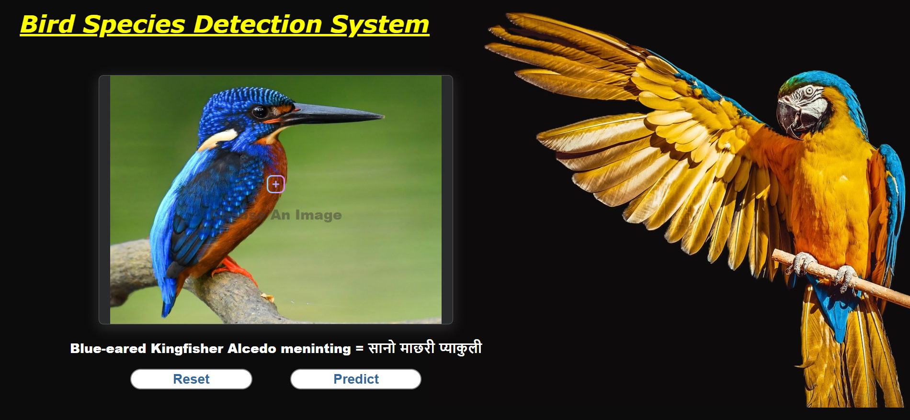

# Bird Species Detection Using Convolutional Neural Networks (CNN)

### Project Overview
This project aims to develop a bird species detection system using deep learning techniques, specifically Convolutional Neural Networks (CNN). The system is designed to identify and classify different bird species from images and provide their Nepali names and scientific names. This model serves a broad range of users including bird enthusiasts, researchers, and conservationists.

### Motivation
Identifying bird species manually is a time-consuming and error-prone process, especially for non-experts. This system automates the identification process, making it easier for users to recognize bird species accurately. This project contributes to avian research, education, and conservation efforts, particularly for endangered species in Nepal.

### Key Features
1. Accurate bird species identification from images using CNN.
2. Provides both Nepali and scientific names of the identified bird species.
3. Can handle a dataset of 38 bird species.
4. The system is designed to work with images and has future potential for expansion to include audio recordings.

### Technology Stack
1. Programming Language: Python
2. Deep Learning Framework: PyTorch
3. Frontend: HTML, CSS, JavaScript
4. Backend Framework: Flask
5. Other Libraries: NumPy, Scikit-learn, Matplotlib, Optuna

### Dependencies:
1. Python 3.x
2. PyTorch
3. Flask
4. NumPy
5. Scikit-learn
6. Matplotlib

### Dataset
The dataset used in this project consists of 8073 training images and 402 test images representing 38 different bird species. Each species is labeled with a unique identifier, which is mapped to both its Nepali and scientific names.

### Model Architecture
The bird species detection system is built using a Convolutional Neural Network (CNN) that consists of:

1. Convolutional layers for feature extraction
2. Pooling layers for downsampling
3. Fully connected layers for classification
4. Softmax activation to predict the bird species

The model also includes techniques such as data augmentation (horizontal flip, rotation, color jitter) to improve generalization and cross-validation for robust performance evaluation.

### Results
The model achieves:
1. 73% training accuracy
2. 76% validation accuracy

Further improvements can be made by expanding the dataset and incorporating more diverse bird species.

### Result Page

### Usage
1. Upload an image of a bird using the provided web interface.
2. The system will classify the bird species and display the Nepali and scientific names.

### Future Enhancements
1. Expand dataset to include more bird species.
2. Integrate audio recordings for species detection.
3. Improve model accuracy by experimenting with different CNN architectures.
4. Crowd-sourced dataset: Allow users to contribute images to expand the training dataset.

### Limitations
1. The model is limited to the current dataset of 38 species.
2. It may not perform well with blurry images or images containing multiple birds.
3. The system does not currently support audio-based bird detection.

### Contribution
Feel free to submit issues or contribute to the project by creating a pull request.

### License
This project is licensed under the MIT License.

